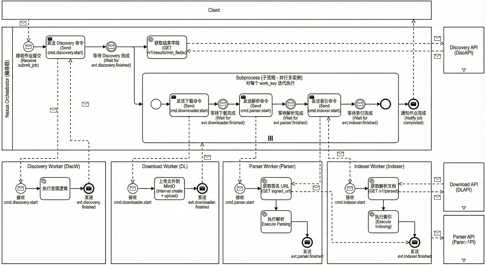
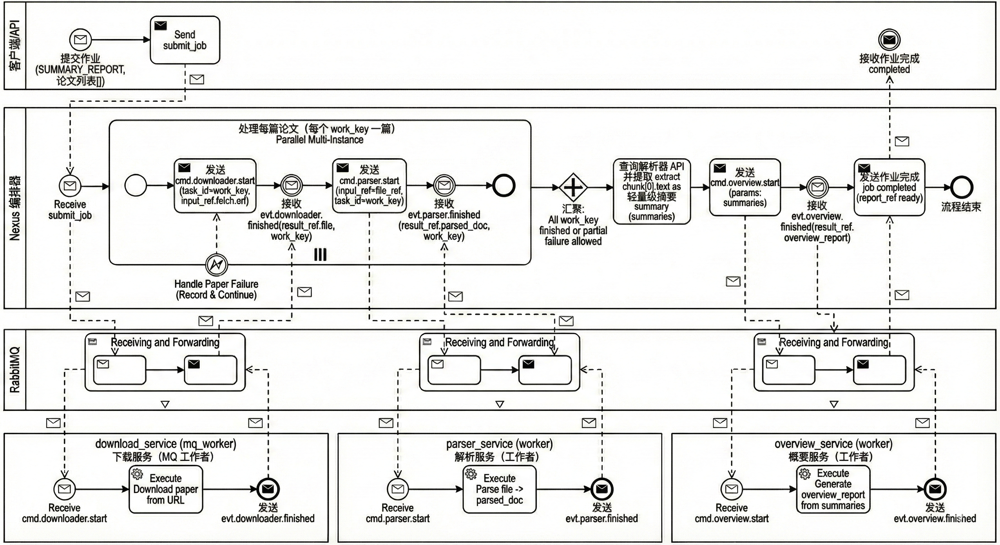

## Feature Nexus 总体架构（Orchestration + Microservices）

本文档面向“读者第一次接触仓库”的场景，重点解释：
- 编排中枢 **Nexus** 的调度策略（声明式工作流、stage handler、状态机推进）
- 微服务之间的通信策略（RabbitMQ 命令/事件、Claim-check、ref-only）
- 各核心服务的职责边界、对外接口、依赖的数据存储


### 关键设计点
- **控制面（Control Plane）**：Nexus 负责“**发命令 + 收事件 + 写状态**”（何时发 `cmd.*`、何时进入下一 stage、如何处理失败/收敛）
- **数据面（Data Plane）**：跨服务不传大对象；消息里传 **ref（ResultRef / input_ref / result_ref）**，数据由 owning service 自治（DB/MinIO/Chroma…）
- **ref-only（当前仓库的默认实现）**：Nexus 的 `/artifacts/*` 实际是 **按 `artifacts_refs` 去调用各服务 Query API** 返回 JSON，而不是直接读 MinIO（见 `nexus/app/services/status_service.py`）
- **服务自治 + 可靠投递**：多个工具服务使用 **inbox/outbox** 实现幂等与“先落库后发事件”的可靠性（见 `tool_services/*/app/mq_worker.py`）

---

## 2) Nexus 的调度策略（Scheduling Strategy）

### 2.1 声明式工作流（Declarative Workflows）
工作流由 `nexus/config/workflows.yaml` 定义，核心字段：
- `task_type`: 任务类型（如 `MORNING_REPORT`、`SUMMARY_REPORT`）
- `stages[]`: 每个 stage 包含
  - `stage_type`: `single` / `fan_out` / `fan_in`
  - `command_routing_key`: 发往 MQ 的命令路由键（`cmd.*`）
  - `success_event`/`failure_event`: 期望接收的事件路由键（`evt.*`）
  - `next_stage`: 状态机下一步


### 2.2 “事件驱动状态机”推进（handle_event 驱动）
Nexus 启动后会消费自己的事件队列：收到 `evt.*` 后：
- 读取 `trace_id` 对应的 **JobContext**
- 若事件失败：交给 failure handler 记录失败（并在部分 fan-out 场景允许继续）
- 若事件成功：交给对应 stage handler 更新状态并触发下一步 `cmd.*`

在代码中体现为：
- `WorkflowOrchestrator.submit_job()`：创建 `trace_id`、持久化初始 JobContext、发出第一条 `cmd.*`
- `WorkflowOrchestrator.handle_event()`：按事件类型分发到 handler（并做 ref-only 的 `result_ref` 归档）

**ref-only 的归档规则（非常关键）**：
- Nexus 会把每个事件的 `payload.result_ref` 写入 `JobContext.artifacts_refs`（并同步到 Orchestration DB 的 `artifacts_index` 表）。
- 归档 key 的默认规则是：
  - 无 `work_key`：`{stage}`（例如 `discovery`、`overview`）
  - 有 `work_key`：`{stage}:{work_key}`（例如 `downloader:task:<trace>:work:0`、`parser:...`、`indexer:...`）
- stage 还可能有“别名 key”，例如 discovery 会额外写入 `search_results`（见 `WorkflowOrchestrator.handle_event()` 和 `DiscoveryFinishedHandler`）。

### 2.3 fan-out / fan-in 的实现方式（不是“并行线程”，而是“并行 work_key”）
- **fan-out（典型：discovery -> downloader）**：
  - discovery 完成后，Nexus 拉取 discovery API 的 `min_fields` 结果
  - 生成多个 `work_key`（一个 work_key 对应一个子任务）
  - 并发发布多条 `cmd.downloader.start`（每条带不同 task_id=work_key）
- **fan-in（典型：SUMMARY_REPORT 的 overview）**：
  - 当一组 work_key 都完成后（或允许部分失败后满足收敛条件），触发聚合类命令（如 `cmd.overview.start`）
  - 聚合命令的 params 中包含 summaries/refs 等聚合所需信息

**work_key 的格式（当前代码的 canonical 形式）**：
- `task:{trace_id}:work:{index}`（见 `nexus/app/engine/utils.py::generate_work_key`）
- MQ 的 `task_id` 通常为 `trace_id`（single）或 `work_key`（fan-out）

### 2.4 状态存储（JobContext）与一致性
Nexus 的 job state 由 `DBStateManager` 持久化到 **Orchestration DB**（而不是 MinIO）：
- `JobContext`：trace_id、task_type、current_stage、work_keys、completed_work_keys、failures、metadata、artifacts_refs 等
- 并维护事实表：`work_items` 与 `artifacts_index`（便于增量更新与查询）
- 对同一个 trace_id 的写操作加锁（`atomic_update_context`），避免并发事件造成状态撕裂

**以代码为准的表结构（见 `nexus/app/infrastructure/orchestration_db.py`）**：
- `jobs`：每个 trace_id 一行（task_type/status/requested_limit/metadata_json/context_json）
- `work_items`：每个 work_key 一行（status=PENDING/COMPLETED/FAILED，attempt/last_error 等）
- `artifacts_index`：每个 artifact ref 一行（name/ref_json，可 last-write-wins）
- 预留：`inbox_events` / `outbox_events`（目前 Nexus 侧主要在 MQ publish 上做 retry；inbox/outbox 在 tool services 更常见）

**兼容/历史实现**：
- `nexus/app/infrastructure/storage.py` 里还有一个基于 MinIO 的 `StateManager`（读写 `task:{trace_id}:ctx`），用于旧路径/兼容；当前服务启动路径使用 `DBStateManager`（见 `nexus/app/core/lifecycle.py` 和 `nexus/app/api/dependencies.py`）。

### 2.5 Nexus 对外 API（Status / Report / Artifacts）
Nexus 对上层应用提供三类核心端点（见 `nexus/app/api/routes.py`）：
- `POST /api/v1/jobs`：提交任务，返回 `trace_id`
- `GET /api/v1/jobs/{trace_id}`：返回 Job 状态与 artifacts 链接（`JobStatusResponse`）
- `GET /api/v1/jobs/{trace_id}/report`：**标准化聚合报告**（80% 推荐入口，见 `ReportService`）
- `GET /api/v1/jobs/{trace_id}/artifacts/{artifact_key}`：**按 artifact_key 拉取“原始制品”**（调试/高级场景）

**当前实现的关键点**：
- status 返回的 `artifacts` 是 `{artifact_key: "/api/v1/jobs/{trace_id}/artifacts/{artifact_key}"}`（见 `StatusService.get_job_status()`）
- `/artifacts/*` 不是“直接读 MinIO stream passthrough”；它会根据 `artifacts_refs[artifact_key]` 的 `service/type/id` **调用对应微服务的 Query API** 并返回 `application/json`（见 `StatusService.get_artifact_stream()`）

---

## 3) 微服务通信策略（Communication Strategy）

### 3.1 RabbitMQ：命令/事件分离
- **命令交换机**：`nexus.cmd.exchange`（direct）
  - 路由键：`cmd.discovery.start` / `cmd.downloader.start` / `cmd.parser.start` / `cmd.indexer.start` / `cmd.overview.start`
- **事件交换机**：`nexus.evt.exchange`（topic）
  - 路由键：`evt.*.finished` / `evt.*.failed`

Nexus 通过 `MQManager.publish_command()` 发布命令（持久化消息 + retry）。

**以代码为准的默认配置来源**：
- Nexus 侧：`nexus/app/core/config.py::Settings`（`cmd_exchange/evt_exchange/event_queue` 等）
- tool services SDK 侧：`shared/common.py::RabbitConfig`（包含 `NEXUS_CMD_TTL_MS`、DLX/DLQ 等）

**QoS / 背压**：
- Nexus 事件消费：`MQManager.connect()` 默认 `prefetch_count=10`
- tool services 消费：多数 worker 使用 `NEXUS_PREFETCH`（默认 `4` 或 `1`，取决于实现）控制并发拉取，降低 fan-out 堆积风险

#### Message Structure（消息结构：JSON / Request / Response）

> 本节描述 RabbitMQ 上的“命令/事件”消息体结构（**以当前仓库代码实现为准**）。  
> 参考实现：
> - Nexus 侧 envelope：`../nexus/app/models/messages.py`
> - tool services SDK：`../tool_services/sdk/base.py`、`../shared/common.py`
> - v1 合约（ref-only）：`../tool_services/libs/contracts/nexus_contracts/models.py`

##### 1) 消息格式（JSON / XML）

- **当前实现使用 JSON**（UTF-8 编码的 JSON 字符串）。
- **不支持 XML**：MQ 消息体与 SDK/解析逻辑均按 JSON 反序列化处理。

所有 MQ 消息遵循统一“外层 envelope”：

```json
{
  "header": {
    "trace_id": "uuid-or-trace-id",
    "task_type": "MORNING_REPORT",
    "sender": "nexus",
    "timestamp": 1730000000.0
  },
  "payload": {
    "...": "..."
  }
}
```

说明：
- `header.trace_id`：端到端 trace
- `header.task_type`：高层任务类型（Nexus submit 时确定）
- `header.sender`：发送方（如 `nexus` / `parser_service`）
- `header.timestamp`：发送时刻（float 秒）

##### 2) 请求（Request）：Command（`cmd.*`）

Command 是 Nexus → tool service 的“请求”。`payload` 既兼容 legacy 字段，也支持 ref-only v1 字段：

- **legacy（v0-ish）字段（兼容/调试）**：
  - `task_id`：任务标识（single 通常为 `trace_id`；fan-out 通常为 `work_key`）
  - `input_key`：旧式存储 key（ref-only 场景不应依赖）
  - `params`：业务参数（字典）
- **ref-only v1 关键字段（推荐/逐步迁移方向）**：
  - `version`: `"v1"`
  - `command`: 通常等于 routing key（如 `cmd.parser.start`）
  - `trace_id` / `work_key`
  - `input_ref`：claim-check 引用（必须包含 `service/type/id`，可带 `fetch`）
  - `idempotency_key`：幂等键（可选）

示例（v1 推荐形态，字段可按具体 command 扩展 `params`）：

```json
{
  "header": {
    "trace_id": "2f4a6df3-4f6e-4e05-8a54-3c01caa6a9b2",
    "task_type": "MORNING_REPORT",
    "sender": "nexus",
    "timestamp": 1730000000.0
  },
  "payload": {
    "version": "v1",
    "command": "cmd.parser.start",
    "task_id": "task:2f4a6df3-4f6e-4e05-8a54-3c01caa6a9b2:work:0",
    "trace_id": "2f4a6df3-4f6e-4e05-8a54-3c01caa6a9b2",
    "work_key": "task:2f4a6df3-4f6e-4e05-8a54-3c01caa6a9b2:work:0",
    "params": {
      "anyKey": "anyValue"
    },
    "input_ref": {
      "service": "download_service",
      "type": "file",
      "id": "file_uuid_or_id",
      "version": "v1",
      "fetch": {
        "path": "/v1/files/file_uuid_or_id/signed_url"
      }
    },
    "idempotency_key": "cmd.parser.start:2f4a6df3-4f6e-4e05-8a54-3c01caa6a9b2:task:...:work:0"
  }
}
```

##### 3) 响应（Response）：Event（`evt.*`）

Event 是 tool service → Nexus 的“响应”。同样使用 `MessagePackage(header, payload)`，其中 `payload`：

- `status`：`"SUCCESS"` 或 `"FAIL"`
- **ref-only v1 关键字段（推荐）**：
  - `version`: `"v1"`
  - `event`: 通常等于 routing key（如 `evt.parser.finished` / `evt.parser.failed`）
  - `trace_id` / `work_key`
  - `result_ref`：claim-check 引用（必须包含 `service/type/id`）
  - `error`：结构化错误（失败时可选，含 `code/message/details`）
  - `metrics`：可选指标（例如 `duration_ms`）
- legacy 字段 `output_key/input_key/error_msg` 仍可能出现，但在跨服务协作中不应依赖。

示例（成功事件）：

```json
{
  "header": {
    "trace_id": "2f4a6df3-4f6e-4e05-8a54-3c01caa6a9b2",
    "task_type": "MORNING_REPORT",
    "sender": "parser_service",
    "timestamp": 1730000005.0
  },
  "payload": {
    "version": "v1",
    "event": "evt.parser.finished",
    "trace_id": "2f4a6df3-4f6e-4e05-8a54-3c01caa6a9b2",
    "work_key": "task:2f4a6df3-4f6e-4e05-8a54-3c01caa6a9b2:work:0",
    "status": "SUCCESS",
    "result_ref": {
      "service": "parser_service",
      "type": "parsed_doc",
      "id": "doc_id_or_uuid",
      "version": "v1"
    },
    "metrics": {
      "duration_ms": 5123
    }
  }
}
```

示例（失败事件）：

```json
{
  "header": {
    "trace_id": "2f4a6df3-4f6e-4e05-8a54-3c01caa6a9b2",
    "task_type": "MORNING_REPORT",
    "sender": "parser_service",
    "timestamp": 1730000005.0
  },
  "payload": {
    "version": "v1",
    "event": "evt.parser.failed",
    "trace_id": "2f4a6df3-4f6e-4e05-8a54-3c01caa6a9b2",
    "work_key": "task:2f4a6df3-4f6e-4e05-8a54-3c01caa6a9b2:work:0",
    "status": "FAIL",
    "error": {
      "code": "EXCEPTION",
      "message": "PDF parsing failed: ...",
      "details": {
        "stage": "parse"
      }
    },
    "metrics": {
      "duration_ms": 1200
    }
  }
}
```

### 3.2 Claim-check + ref-only（“传引用，不传大对象”）
在 ref-only 模式下：
- **Command** 必须带 `input_ref`（例如 `{service,type,id,fetch:{url}}` 或 `{service,type,id}`）
- **Event** 必须带 `result_ref`
- 大对象（PDF、解析 chunks、报告等）写入 MinIO，由 owning service 决定 key/路径；其它服务/编排层按 ref 或 API 去读取

**协议位置（仓库内的真实定义）**：
- Nexus 侧 envelope（运行时解析）：`nexus/app/models/messages.py`
- 合约/规范（供服务迁移的 v1 合约）：`tool_services/libs/contracts/nexus_contracts/models.py`

**idempotency_key（幂等键）的生成与使用**：
- Nexus `MQManager.publish_command()` 会尽力填充 `idempotency_key = "{routing_key}:{trace_id}:{task_id}"`（嵌入 payload）
- 多个 tool services 的 mq_worker 会把该 key 写入 inbox 表去重；缺失时会用 fallback 规则自行生成（见 `tool_services/parser_service/app/mq_worker.py`、`tool_services/download_service/app/mq_worker.py` 等）

### 3.3 服务间 HTTP：只读查询/取产物
为了避免共享存储语义或 DB 直连，部分阶段会走 HTTP 查询：
- Nexus 读取 discovery 结果：`discovery_service` 的 `/v1/results/{result_id}/min_fields`
- indexer worker 读取 parsed：调用 `parser_service` 的 `/v1/parsed/{doc_id}`
- parser worker 拉取 pdf bytes：调用 `download_service` 的 `/v1/files/{file_id}/signed_url`
- retrieval_service 统一代理语义检索：调用 `indexing_service` 的 `/search`、`/kb/overview`

**Nexus /artifacts 端点也依赖 Query APIs**（见 `StatusService.get_artifact_stream()`）：
- discovery.search_result → `GET {discovery_base_url}/v1/results/{id}`
- parser.parsed_doc → `GET {parser_base_url}/v1/parsed/{id}`
- download.file → `GET {download_base_url}/v1/files/{id}/signed_url`（返回 JSON，通常包含可下载 URL）
- overview.overview_report → `GET {overview_base_url}/v1/reports/{id}`

### 3.4 幂等与可靠投递：Inbox/Outbox（服务自治）
多个 tool services 内部实现了 inbox/outbox：
- **inbox**：记录已处理消息（基于 `idempotency_key`），避免重复消费
- **outbox**：先落库，再异步发布 `evt.*`，提升可靠性（避免“处理完成但发事件失败”）

**典型实现模式（以 parser/download 为例）**：
- 消费 cmd：
  - 解析消息 → 计算/读取 `idempotency_key` → `record_inbox()`；重复则直接 `return`
- 处理业务：
  - 写服务自有 DB / 写 MinIO（或本地/MockStorage）
- 写 outbox：
  - 在 DB 事务中插入 `outbox_events`（event_id 通常为 `"{evt_rk}:{trace_id}:{work_key}"`）
- publisher loop：
  - 周期性扫描 `outbox_events(status=PENDING)` → publish 到 `evt_exchange` → 标记 PUBLISHED/FAILED

**DLQ / TTL（用于防止队列堆积导致“永远 pending”）**：
- `shared/common.py::RabbitConfig` 支持：
  - `DLX_EXCHANGE`（死信交换机）+ `DLQ_QUEUE`（死信队列）
  - `NEXUS_CMD_TTL_MS`：命令队列 TTL（<=0 视为禁用；SDK 会跳过 `x-message-ttl`）

---

## 4) 两条关键链路（时序图）

### 4.1 MORNING_REPORT：discovery → downloader(fan-out) → parser → indexer


### 4.2 SUMMARY_REPORT：提交时 fan-out downloader → parser → fan-in overview


---

## 5) 服务清单：职责 / 接口 / 数据库（摘要版）

### discovery_service
- **职责**：外部资源发现；结果索引（result_id → output_key）；cmd/evt worker
- **HTTP**：`/v1/results/{result_id}`、`/v1/results/{result_id}/min_fields`、健康检查三件套
- **DB**：Postgres（results + inbox/outbox），可选 Redis 缓存；MinIO（claim-check）

### download_service
- **职责**：下载任务/文件管理；存储 PDF 到 MinIO；提供 signed URL；同时具备 MQ worker 与 Celery worker
- **HTTP**：`/download`、`/files/...`、健康检查三件套
- **DB**：Postgres + Redis + MinIO

### parser_service
- **职责**：从 file_ref → 解析 PDF → parsed_doc；写 MinIO + 索引表；cmd/evt worker
- **HTTP**：`/v1/parsed/{doc_id}`、健康检查三件套
- **DB**：Postgres + MinIO（并依赖 download_service API）

### indexing_service
- **职责**：入库（元数据/倒排）+ 向量索引（Chroma）；cmd/evt worker；检索 API
- **HTTP**：`/index`、`/search`、`/kb/overview`、健康检查三件套
- **DB**：Postgres + Chroma

### overview_service
- **职责**：fan-in 聚合生成综述；报告写 MinIO；同时提供只读查询 API
- **HTTP**：`/v1/reports/{trace_id}`、健康检查三件套
- **DB**：MinIO（worker 依赖外部 LLM）

### retrieval_service
- **职责**：统一检索编排层；语义检索调用 indexing_service
- **HTTP**：`/search`、`/semantic_search`、`/kb/overview`、健康检查三件套
- **DB**：SQLite + 下游 indexing_service

### translator_service
- **职责**：文本/图片多模态翻译；对外 API + unified_backend
- **HTTP**：`/translate`、健康检查三件套
- **DB**：Postgres + Redis

---

## 6) Application Service（用户服务与应用层）

### 6.1 职责与定位

Application Service 是面向用户的应用层服务，位于前端与底层微服务（Nexus Orchestration Service、Indexing Service、Translator Service 等）之间，提供：

- **用户认证与授权**：用户注册、登录、会话管理
- **订阅管理**：用户学术订阅（期刊、学者、关键词）的 CRUD 操作
- **业务功能代理**：将前端请求转发到相应的底层服务，并进行数据格式转换
  - 学术日报：代理到 Nexus Orchestration Service 的 `MORNING_REPORT` 任务
  - 文献综述：代理到 Nexus Orchestration Service 的 `SUMMARY_REPORT` 任务
  - 文献检索：代理到 Indexing Service 的 `/search` API
  - 文献翻译：代理到 Translator Service 的 `/translate-paper` API

### 6.2 技术架构

**技术栈**：
- **Web 框架**：FastAPI（Python）
- **ORM**：SQLAlchemy
- **数据库**：PostgreSQL（用户数据、订阅数据）
- **HTTP 客户端**：`requests`（调用下游服务）

**目录结构**（`application_service/`）：
```
application_service/
├── main.py              # FastAPI 应用入口，路由注册
├── config.py            # 配置管理（环境变量）
├── database.py          # 数据库连接与 Session 管理
├── models.py            # SQLAlchemy 数据模型（User, UserSubscription）
├── schemas.py           # Pydantic 请求/响应模型
├── auth.py              # 密码哈希与验证工具
├── routers/             # 路由模块
│   ├── auth.py          # 认证路由（注册、登录）
│   ├── subscriptions.py  # 订阅管理路由
│   ├── morning_report.py # 学术日报路由
│   ├── literature_review.py    # 文献综述路由
│   ├── literature_search.py    # 文献检索路由
│   └── literature_translation.py # 文献翻译路由
└── requirements.txt     # Python 依赖
```

### 6.3 数据模型

**User（用户表）**：
- `id`（BigInteger，主键）
- `username`（String(50)，唯一，索引）
- `email`（String(100)，唯一，索引）
- `password_hash`（String(255)）
- `subscriptions`（关系：一对多，UserSubscription）

**UserSubscription（订阅表）**：
- `id`（BigInteger，主键）
- `user_id`（BigInteger，外键 → User.id，CASCADE 删除）
- `subscription_type`（String(20)）：`"journal"` / `"scholar"` / `"keyword"`
- `subscription_value`（String(100)）
- 唯一约束：`(user_id, subscription_type, subscription_value)`

### 6.4 API 设计

**认证机制**：
- 当前实现使用 **请求头 `X-User-ID`** 传递用户身份（简化版，生产环境建议使用 JWT）
- 注册/登录接口返回用户信息（不含密码），前端保存用户 ID 并在后续请求中携带

**API 分组**：
- `/api/auth/*`：认证相关（注册、登录）
- `/api/subscriptions/*`：订阅管理（CRUD）
- `/api/morning-report/*`：学术日报
- `/api/literature-review`：文献综述
- `/api/literature-search`：文献检索
- `/api/translate-paper`：文献翻译

**数据转换**：
- Application Service 负责将底层服务的响应格式转换为前端期望的格式
- 例如：Nexus 的 `MORNING_REPORT` 报告格式 → 前端期望的 `search_results` 格式

### 6.5 与下游服务的交互

**Nexus Orchestration Service**：
- 学术日报：`POST /api/v1/jobs`（`task_type: "MORNING_REPORT"`）→ 轮询 `GET /api/v1/jobs/{trace_id}` → `GET /api/v1/jobs/{trace_id}/report`
- 文献综述：`POST /api/v1/jobs`（`task_type: "SUMMARY_REPORT"`）→ 等待完成 → `GET /api/v1/jobs/{trace_id}/report`

**Indexing Service**：
- 文献检索：`POST /search`（透传参数，转换响应格式）

**Translator Service**：
- 文献翻译：`POST /api/v1/translate/image`（multipart/form-data，文件上传）

### 6.6 配置与环境变量

**关键配置**（`config.py`）：
- `API_BASE_URL`：Nexus Orchestration Service 的 API 前缀（如 `"http://localhost:8000/api/v1"`）
- `BASE_HOST`：Nexus Orchestration Service 的基础 URL（如 `"http://localhost:8000"`）
- `INDEXING_SERVICE_BASE_URL`：Indexing Service 的基础 URL（如 `"http://localhost:8020"`）
- `TRANSLATOR_SERVICE_BASE_URL`：Translator Service 的基础 URL（如 `"http://localhost:8002"`）
- `DATABASE_URL`：PostgreSQL 连接字符串

---

## 7) Frontend（前端应用）

### 7.1 职责与定位

Frontend 是面向用户的 Web 应用，提供：
- **用户界面**：登录、首页、学术日报、文献综述、文献翻译、文献检索等功能页面
- **状态管理**：用户认证状态、订阅数据、搜索结果等
- **API 调用**：通过 HTTP 请求调用 Application Service 的 API

### 7.2 技术架构

**技术栈**：
- **框架**：Vue 3（Composition API）
- **路由**：Vue Router
- **构建工具**：Vite
- **HTTP 客户端**：`fetch` API（通过 composables 封装）

**目录结构**（`frontend/`）：
```
frontend/
├── index.html           # HTML 入口
├── package.json         # 依赖管理
├── vite.config.js       # Vite 配置
├── src/
│   ├── main.js          # 应用入口
│   ├── App.vue          # 根组件（布局、侧边栏、路由视图）
│   ├── config.js        # 配置（API_BASE_URL, MINIO_UPLOAD_URL）
│   ├── style.css        # 全局样式
│   ├── router/
│   │   └── index.js     # 路由配置
│   ├── composables/     # 组合式函数
│   │   ├── useAuth.js           # 认证状态管理
│   │   └── useSubscriptions.js  # 订阅数据管理
│   └── views/           # 页面组件
│       ├── Login.vue                    # 登录页
│       ├── Home.vue                     # 首页
│       ├── DailySubscription/           # 学术日报
│       │   ├── Settings.vue            # 订阅设置
│       │   └── Updates.vue             # 日报更新
│       ├── LiteratureReview/           # 文献综述
│       │   └── Settings.vue            # 综述设置
│       ├── LiteratureTranslation/      # 文献翻译
│       │   └── Settings.vue            # 翻译设置
│       └── LiteratureSearch/           # 文献检索
│           └── Settings.vue            # 检索设置
```

### 7.3 路由设计

**路由列表**（`router/index.js`）：
- `/login`：登录页（`requiresAuth: false`）
- `/`：首页（`requiresAuth: true`）
- `/daily-subscription`：学术日报（重定向到 `/daily-subscription/updates`）
  - `/daily-subscription/updates`：日报更新页面
- `/literature-review`：文献综述
- `/literature-translation`：文献翻译
- `/literature-search`：文献检索

**路由守卫**：
- 所有需要认证的路由（`meta.requiresAuth: true`）会检查用户登录状态
- 未登录用户会被重定向到 `/login`，并保存原始路径以便登录后跳转

### 7.4 状态管理

**useAuth（认证状态）**：
- `user`：当前用户信息（从 localStorage 读取）
- `checkAuth()`：检查是否已登录
- `login()`：登录（调用 `/api/auth/login`，保存用户信息）
- `logout()`：登出（清除用户信息）

**useSubscriptions（订阅数据）**：
- `subscriptions`：订阅列表
- `loadSubscriptions()`：加载订阅（调用 `/api/subscriptions`）
- `createSubscription()`：创建订阅
- `updateSubscription()`：更新订阅
- `deleteSubscription()`：删除订阅

### 7.5 UI 布局

**App.vue 布局结构**：
- **主侧边栏**（左侧，可折叠）：
  - Logo 与品牌名称
  - 导航菜单（首页、学术日报、文献综述、文献翻译、文献检索）
  - 用户信息与退出登录
- **二级侧边栏**（左侧第二个，条件显示）：
  - 学术日报页面：订阅设置侧栏
  - 文献综述页面：综述设置侧栏
  - 文献翻译页面：翻译设置侧栏
  - 文献检索页面：检索设置侧栏
- **主内容区**（右侧）：
  - `<router-view>`：显示当前路由对应的页面组件
  - 使用 `<keep-alive>` 缓存页面状态

**响应式设计**：
- 桌面端（>1024px）：侧边栏固定显示，可折叠
- 移动端（≤1024px）：侧边栏隐藏，通过菜单按钮打开

### 7.6 API 调用

**配置**（`config.js`）：
- `API_BASE_URL`：Application Service 的基础 URL（从环境变量 `VITE_API_BASE_URL` 读取）
- `MINIO_UPLOAD_URL`：MinIO 上传服务器 URL（从环境变量 `VITE_MINIO_UPLOAD_URL` 读取）

**请求头**：
- 所有需要认证的请求都会在请求头中添加 `X-User-ID`（从 `useAuth` 获取）

**错误处理**：
- HTTP 错误响应会在组件中显示错误提示
- 401 Unauthorized 会触发登出并跳转到登录页

### 7.7 数据流

**典型流程（以学术日报为例）**：
1. 用户在设置侧栏配置查询参数（query、limit、filters）
2. 点击"生成日报"按钮
3. 前端调用 `POST /api/morning-report`，获取 `trace_id`
4. 前端轮询 `GET /api/morning-report/{trace_id}` 直到任务完成
5. 显示结果（论文列表与摘要）

**文件上传流程（文献翻译）**：
1. 用户选择 PDF 文件
2. 前端先上传文件到 MinIO（获取 presigned URL）
3. 前端调用 `POST /api/translate-paper`，传递文件与目标语言
4. 显示翻译结果

---

## 8) 整体架构图

```
┌─────────────────────────────────────────────────────────────┐
│                        Frontend (Vue 3)                      │
│  ┌──────────┐  ┌──────────┐  ┌──────────┐  ┌──────────┐    │
│  │   Login  │  │   Home   │  │  Daily   │  │Literature│    │
│  │          │  │          │  │Subscription│ │ Review   │    │
│  └──────────┘  └──────────┘  └──────────┘  └──────────┘    │
└───────────────────────────┬─────────────────────────────────┘
                             │ HTTP (REST API)
                             │ X-User-ID Header
┌─────────────────────────────▼─────────────────────────────────┐
│              Application Service (FastAPI)                     │
│  ┌──────────────┐  ┌──────────────┐  ┌──────────────┐      │
│  │ Auth Router  │  │ Subscriptions│  │ Morning Report│      │
│  │              │  │    Router    │  │    Router    │      │
│  └──────────────┘  └──────────────┘  └──────────────┘      │
│  ┌──────────────┐  ┌──────────────┐  ┌──────────────┐      │
│  │Literature    │  │Literature    │  │Literature    │      │
│  │Review Router │  │Search Router │  │Translation   │      │
│  └──────────────┘  └──────────────┘  └──────────────┘      │
│                                                                 │
│  PostgreSQL (User, Subscriptions)                             │
└───────────┬──────────────┬──────────────┬────────────────────┘
             │              │              │
    ┌────────▼────┐  ┌──────▼──────┐  ┌──▼──────────┐
    │   Nexus     │  │  Indexing   │  │ Translator  │
    │Orchestration│  │   Service   │  │  Service    │
    │  Service    │  │             │  │             │
    └─────────────┘  └──────────────┘  └──────────────┘
             │              │              │
             └──────────────┴──────────────┘
                           │
                    ┌──────▼──────┐
                    │  RabbitMQ   │
                    │  (Commands  │
                    │   & Events) │
                    └─────────────┘
```

**说明**：
- Frontend 通过 HTTP 调用 Application Service
- Application Service 作为应用层，代理请求到底层微服务（Nexus、Indexing、Translator）
- Nexus Orchestration Service 通过 RabbitMQ 协调各工具服务（discovery、downloader、parser、indexer、overview）
- Application Service 使用 PostgreSQL 存储用户数据与订阅数据


