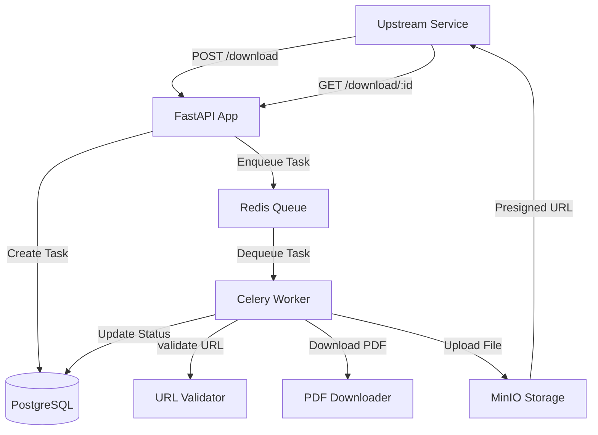
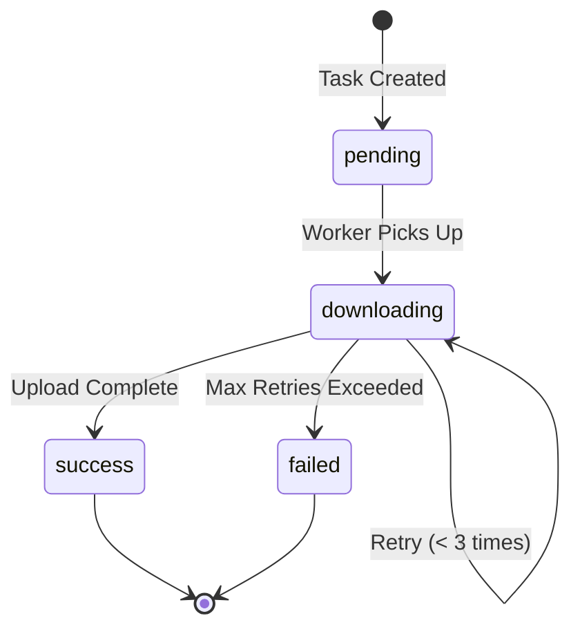

# Design Document

## Overview

The Literature Download Service is a microservice architecture built with FastAPI and Celery that handles asynchronous downloading of academic literature PDFs. The system follows a task queue pattern where API requests create tasks that are processed by background workers, with all state managed in PostgreSQL and files stored in MinIO.

### Architecture Diagram



## Architecture

### System Components

1. **FastAPI Application**: Synchronous HTTP API server handling task creation and status queries
2. **Celery Worker**: Asynchronous task processor executing download operations
3. **Redis**: Message broker and result backend for Celery
4. **PostgreSQL**: Relational database for task and file metadata
5. **MinIO**: S3-compatible object storage for PDF files

### Technology Stack

- **Language**: Python 3.10+
- **Web Framework**: FastAPI
- **Task Queue**: Celery with Redis broker
- **ORM**: SQLAlchemy 2.0
- **Storage Client**: minio-py
- **HTTP Client**: httpx for async operations
- **Configuration**: Pydantic Settings
- **Testing**: pytest + httpx

### Design Patterns

1. **Repository Pattern**: Database access abstracted through repository classes
2. **Service Layer**: Business logic separated from API routes
3. **Task Queue Pattern**: Long-running operations delegated to background workers
4. **Retry Pattern**: Exponential backoff for transient failures
5. **Dependency Injection**: FastAPI dependencies for database sessions and services

## Components and Interfaces

### 1. API Layer (`app/routes/download.py`)

**Endpoints:**

```python
POST /download
Request: {"url": "https://arxiv.org/pdf/1234.5678.pdf"}
Response: {"task_id": "uuid", "status": "pending"}

GET /download/{task_id}
Response: {
    "task_id": "uuid",
    "status": "success|pending|downloading|failed",
    "file_url": "presigned_url or null",
    "error_message": "error details or null",
    "created_at": "timestamp",
    "updated_at": "timestamp"
}
```

**Design Decisions:**

- Immediate response with task_id to avoid blocking upstream services
- Status polling pattern instead of webhooks for simplicity
- Presigned URLs with 1-hour expiration for security

### 2. Database Models (`app/models/`)

**task.py - DownloadTask Model:**

```python
class TaskStatus(str, Enum):
    PENDING = "pending"
    DOWNLOADING = "downloading"
    SUCCESS = "success"
    FAILED = "failed"

class DownloadTask(Base):
    __tablename__ = "download_task"

    id: UUID (primary key)
    url: str (indexed)
    status: TaskStatus
    retry_count: int (default 0)
    error_message: str (nullable)
    file_id: UUID (foreign key, nullable)
    created_at: datetime
    updated_at: datetime

    # Relationship
    file: DocumentFile (one-to-one)
```

**file.py - DocumentFile Model:**

```python
class DocumentFile(Base):
    __tablename__ = "document_file"

    id: UUID (primary key)
    file_name: str
    minio_bucket: str
    minio_object: str
    mime_type: str
    file_size: int
    created_at: datetime
```

**Design Decisions:**

- UUID for distributed system compatibility
- Separate file table for potential future reuse
- Status enum for type safety
- Indexed URL for duplicate detection (future enhancement)

### 3. Service Layer

**services/validator.py - URLValidator:**

```python
class URLValidator:
    async def is_reachable(url: str) -> tuple[bool, str]:
        """
        Validates URL reachability using HEAD then GET fallback.
        Returns (is_valid, error_message)
        Timeout: 10 seconds
        """
```

**Design Decisions:**

- HEAD request first to minimize bandwidth
- GET fallback for servers that don't support HEAD
- Async implementation for non-blocking validation
- Returns tuple for both status and error context

**services/downloader.py - PDFDownloader:**

```python
class PDFDownloader:
    async def download(url: str) -> tuple[bytes, str]:
        """
        Downloads file from URL.
        Returns (file_content, filename)
        Streams large files to avoid memory issues
        """
```

**Design Decisions:**

- Streaming download for large PDFs (>100MB)
- Extract filename from Content-Disposition or URL
- Validate Content-Type is PDF-related
- Memory-efficient chunk processing

**services/storage.py - MinIOStorage:**

```python
class MinIOStorage:
    def __init__(self, endpoint, access_key, secret_key, bucket):
        self.client = Minio(...)
        self.bucket = bucket

    def ensure_bucket_exists(self):
        """Creates bucket if not exists"""

    def upload_file(self, file_content: bytes, object_name: str,
                   content_type: str) -> str:
        """
        Uploads file to MinIO.
        Returns object_name
        """

    def get_presigned_url(self, object_name: str,
                         expires: int = 3600) -> str:
        """Generates presigned URL for file access"""
```

**Design Decisions:**

- Lazy bucket creation on first upload
- Object naming: `{task_id}/{filename}` for organization
- 1-hour presigned URL expiration as default
- Synchronous client (minio-py doesn't support async)

### 4. Task Layer (`app/tasks/download_task.py`)

**Celery Task:**

```python
@celery_app.task(bind=True, max_retries=3)
def download_pdf_task(self, task_id: str):
    """
    Main download task with retry logic.

    Steps:
    1. Update status to 'downloading'
    2. Validate URL
    3. Download PDF
    4. Upload to MinIO
    5. Create file record
    6. Update task status to 'success'

    On failure: Retry with exponential backoff (5s, 25s, 125s)
    """
```

**Design Decisions:**

- Bind task to access self.retry()
- Exponential backoff: 5 \* (2 \*\* retry_count)
- Update database at each state transition
- Catch and log all exceptions for debugging
- Store error message in database on final failure

### 5. Configuration (`app/config.py`)

```python
class Settings(BaseSettings):
    # Database
    database_url: str

    # Redis
    redis_url: str = "redis://localhost:6379/0"

    # MinIO
    minio_endpoint: str
    minio_access_key: str
    minio_secret_key: str
    minio_bucket: str = "papers"
    minio_secure: bool = False

    # Celery
    celery_broker_url: str
    celery_result_backend: str

    class Config:
        env_file = ".env"
```

**Design Decisions:**

- Pydantic Settings for validation and type safety
- Sensible defaults for development
- Separate Redis databases for broker (0) and backend (1)
- Support for .env file in development

## Data Models

### Database Schema

```sql
-- download_task table
CREATE TABLE download_task (
    id UUID PRIMARY KEY DEFAULT gen_random_uuid(),
    url TEXT NOT NULL,
    status VARCHAR(20) NOT NULL,
    retry_count INTEGER DEFAULT 0,
    error_message TEXT,
    file_id UUID REFERENCES document_file(id),
    created_at TIMESTAMP DEFAULT NOW(),
    updated_at TIMESTAMP DEFAULT NOW()
);

CREATE INDEX idx_download_task_status ON download_task(status);
CREATE INDEX idx_download_task_created_at ON download_task(created_at);

-- document_file table
CREATE TABLE document_file (
    id UUID PRIMARY KEY DEFAULT gen_random_uuid(),
    file_name TEXT NOT NULL,
    minio_bucket TEXT NOT NULL,
    minio_object TEXT NOT NULL,
    mime_type TEXT NOT NULL,
    file_size INTEGER NOT NULL,
    created_at TIMESTAMP DEFAULT NOW()
);

CREATE INDEX idx_document_file_minio_object ON document_file(minio_bucket, minio_object);
```

### Task State Machine



## Error Handling

### Error Categories

1. **Validation Errors (4xx)**

   - Missing URL in request
   - Invalid URL format
   - Task not found
   - Response: HTTP 422/404 with error details

2. **URL Unreachable Errors**

   - DNS resolution failure
   - Connection timeout
   - HTTP 404/5xx from source
   - Action: Retry up to 3 times, then mark as failed

3. **Download Errors**

   - Network interruption
   - Incomplete download
   - Invalid content type
   - Action: Retry with exponential backoff

4. **Storage Errors**

   - MinIO connection failure
   - Bucket creation failure
   - Upload failure
   - Action: Retry, log detailed error

5. **Database Errors**
   - Connection pool exhausted
   - Constraint violations
   - Action: Retry transaction, alert on persistent failures

### Retry Strategy

```python
# Celery task configuration
@celery_app.task(
    bind=True,
    max_retries=3,
    default_retry_delay=5,
    autoretry_for=(RequestException, MinioException),
    retry_backoff=True,
    retry_backoff_max=600,
    retry_jitter=True
)
```

**Backoff Schedule:**

- Attempt 1: Immediate
- Attempt 2: 5 seconds
- Attempt 3: 25 seconds (5 \* 2^2)
- Attempt 4: 125 seconds (5 \* 2^3)

### Logging Strategy

```python
# Structured logging with context
logger.info("download_started", extra={
    "task_id": task_id,
    "url": url,
    "attempt": retry_count
})

logger.error("download_failed", extra={
    "task_id": task_id,
    "error": str(e),
    "traceback": traceback.format_exc()
})
```

## Testing Strategy

### Unit Tests

**Scope:** Individual components in isolation

1. **URL Validator Tests**

   - Valid URLs return True
   - Invalid URLs return False
   - Timeout handling
   - HEAD/GET fallback logic

2. **Downloader Tests**

   - Successful download
   - Filename extraction
   - Content-Type validation
   - Streaming for large files

3. **Storage Tests**

   - Bucket creation
   - File upload
   - Presigned URL generation
   - Error handling

4. **Model Tests**
   - Field validation
   - Relationship integrity
   - Enum constraints

### Integration Tests

**Scope:** Component interactions with real dependencies

1. **API + Database Tests**

   - Task creation persists to database
   - Status query retrieves correct data
   - Error responses for invalid inputs

2. **Celery + Database Tests**
   - Task execution updates database
   - Retry logic increments retry_count
   - Final status reflects outcome

### End-to-End Tests

**Scope:** Full pipeline with real external dependencies

**Test File:** `tests/test_download_integration.py`

**Test Scenario:**

```python
async def test_full_download_pipeline():
    # 1. Submit download request
    response = await client.post("/download", json={
        "url": "https://www.w3.org/WAI/ER/tests/xhtml/testfiles/resources/pdf/dummy.pdf"
    })
    task_id = response.json()["task_id"]

    # 2. Start Celery worker (subprocess)
    worker_process = start_celery_worker()

    # 3. Poll status until completion (max 60s)
    for _ in range(30):
        status_response = await client.get(f"/download/{task_id}")
        if status_response.json()["status"] in ["success", "failed"]:
            break
        await asyncio.sleep(2)

    # 4. Verify success
    assert status_response.json()["status"] == "success"
    file_url = status_response.json()["file_url"]

    # 5. Verify file accessibility
    file_response = requests.get(file_url)
    assert file_response.status_code == 200
    assert file_response.headers["Content-Type"] == "application/pdf"

    # 6. Cleanup
    cleanup_test_files(task_id)
    worker_process.terminate()
```

**Test Infrastructure:**

- Use Docker Compose test profile for isolated environment
- Pytest fixtures for database setup/teardown
- Automatic cleanup of test data
- Detailed logging on failure

### Test Coverage Goals

- Unit tests: >80% code coverage
- Integration tests: All API endpoints
- E2E tests: Happy path + common failure scenarios

## Deployment Architecture

### Docker Compose Services

```yaml
services:
  app:
    build: .
    ports: ["8000:8000"]
    depends_on: [db, redis, minio]
    environment:
      - DATABASE_URL=postgresql://user:pass@db:5432/downloads
      - REDIS_URL=redis://redis:6379/0
      - MINIO_ENDPOINT=minio:9000

  celery:
    build: .
    command: celery -A app.celery_app worker --loglevel=info
    depends_on: [db, redis, minio]

  db:
    image: postgres:15
    environment:
      - POSTGRES_DB=downloads
      - POSTGRES_USER=user
      - POSTGRES_PASSWORD=pass

  redis:
    image: redis:7

  minio:
    image: minio/minio
    command: server /data --console-address ":9001"
    ports: ["9000:9000", "9001:9001"]
    environment:
      - MINIO_ROOT_USER=minioadmin
      - MINIO_ROOT_PASSWORD=minioadmin
```

### Scaling Considerations

1. **Horizontal Scaling:**

   - Multiple FastAPI instances behind load balancer
   - Multiple Celery workers for parallel downloads
   - Redis Sentinel for high availability

2. **Performance Optimization:**

   - Connection pooling for PostgreSQL (pool_size=20)
   - Redis connection pooling
   - Celery prefetch_multiplier=1 for fair distribution

3. **Monitoring:**
   - Celery Flower for task monitoring
   - PostgreSQL slow query log
   - MinIO metrics endpoint

## Security Considerations

1. **URL Validation:**

   - Whitelist allowed domains (arXiv, Semantic Scholar, Springer)
   - Prevent SSRF attacks by blocking private IP ranges
   - Validate URL scheme (https only in production)

2. **File Storage:**

   - Presigned URLs with short expiration (1 hour)
   - Bucket policies to prevent public access
   - File size limits (e.g., 100MB max)

3. **API Security:**

   - Rate limiting on endpoints
   - API key authentication (future enhancement)
   - Input validation with Pydantic

4. **Database:**
   - Parameterized queries via SQLAlchemy
   - Connection encryption (SSL)
   - Least privilege database user

## Future Enhancements

1. **Duplicate Detection:** Check if URL already downloaded before creating task
2. **Webhook Notifications:** Push notifications on task completion
3. **Batch Downloads:** Submit multiple URLs in single request
4. **File Metadata Extraction:** Extract title, authors, abstract from PDF
5. **Download Prioritization:** Priority queue for urgent downloads
6. **Metrics Dashboard:** Real-time monitoring of download success rates
