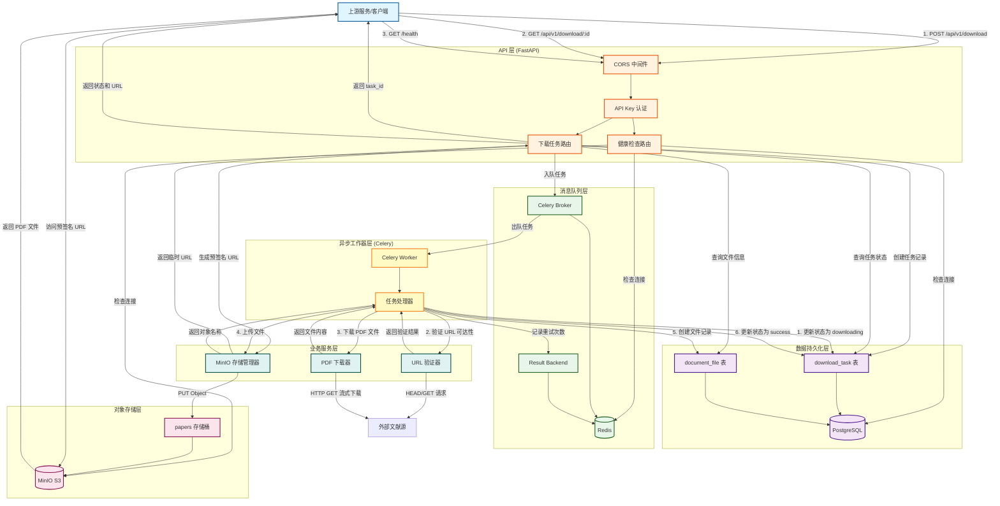
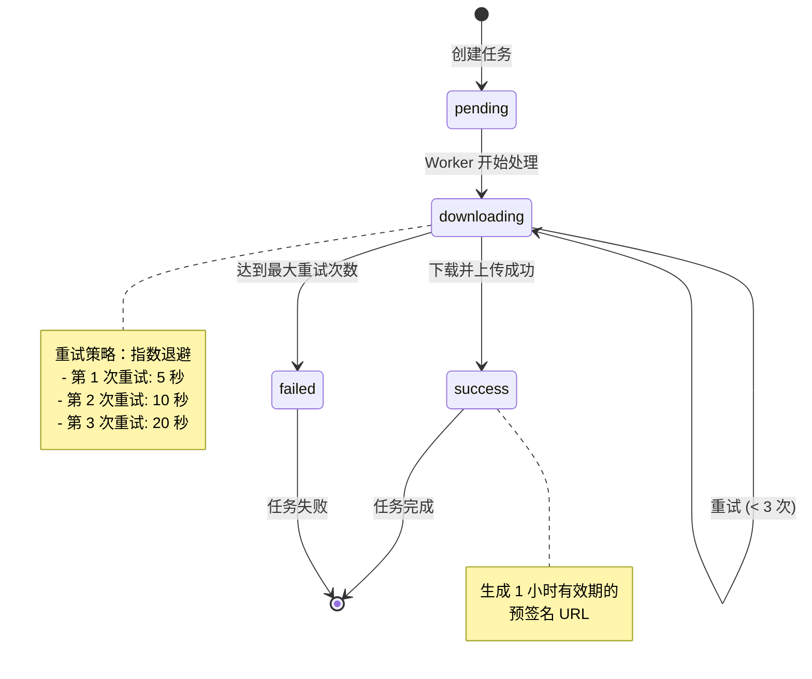
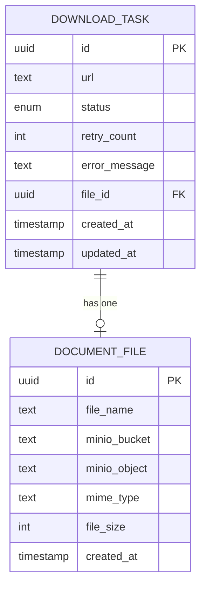
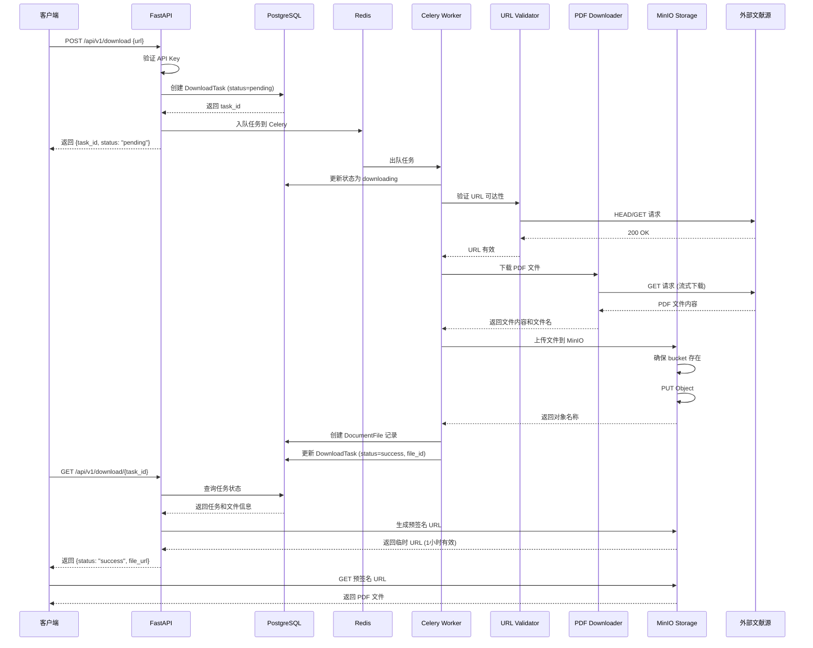
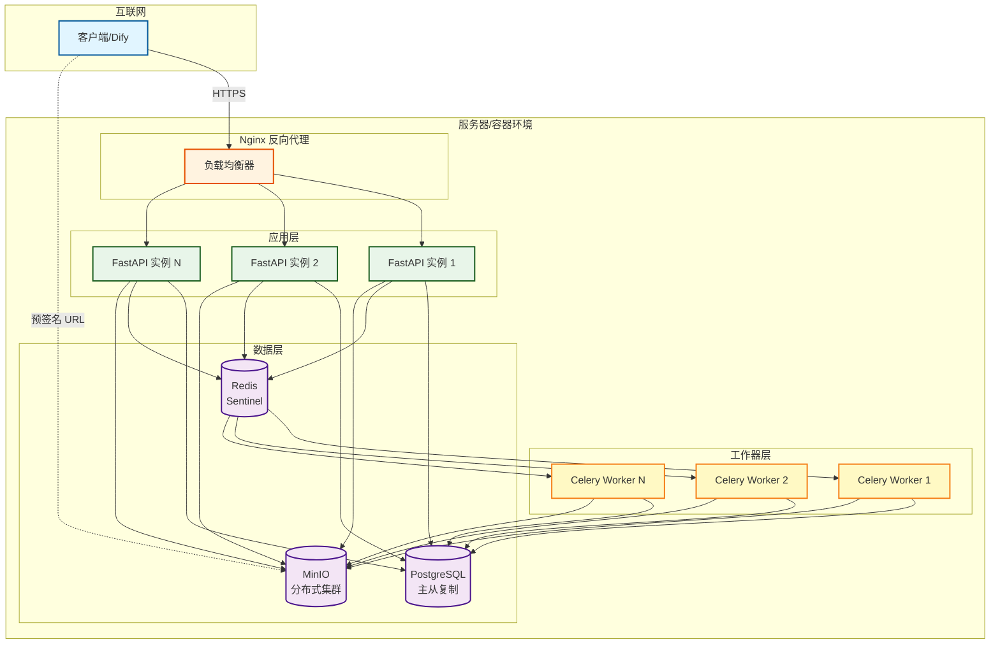

# 系统架构图

## 服务边界 & 职责

### 职责

本服务（文献下载服务）负责：

1. **接收下载请求**：接收来自上游资源发现服务的结构化下载任务（URL + 元数据）
2. **异步任务管理**：创建、调度、追踪下载任务的完整生命周期
3. **文件获取**：从外部文献源（arXiv、Semantic Scholar、Springer 等）下载 PDF 文件
4. **URL 验证**：验证目标 URL 的可达性和有效性，防止无效请求
5. **持久化存储**：将下载的 PDF 文件存储到 MinIO 对象存储
6. **元数据管理**：记录文件信息（文件名、大小、存储位置、MIME 类型）到数据库
7. **任务状态追踪**：维护任务状态（pending → downloading → success/failed）
8. **重试机制**：针对临时故障（网络超时、服务不可用）自动重试
9. **文件访问控制**：生成有时限的预签名 URL，提供安全的文件访问
10. **健康监控**：提供服务健康检查和依赖组件状态监控

### 职责外

本服务**不负责**：

- ❌ **资源发现**：不搜索、检索或推荐文献资源
- ❌ **内容解析**：不解析 PDF 内容、提取文本或元数据
- ❌ **语义理解**：不进行文献内容的深度分析或理解
- ❌ **知识图谱**：不构建文献之间的引用关系或知识网络
- ❌ **全文检索**：不提供文献内容的搜索功能
- ❌ **格式转换**：不转换文件格式（如 PDF → Word/Markdown）
- ❌ **OCR 识别**：不处理扫描版 PDF 的文字识别
- ❌ **版权判断**：不判断文献的版权状态或访问权限
- ❌ **用户管理**：不管理用户账户、权限或配额（仅 API Key 认证）
- ❌ **长期归档**：不提供文献的长期归档和版本管理

### 未来扩展方向

#### 短期扩展（3-6 个月）

1. **更多文献源支持**

   - PubMed Central (PMC)
   - IEEE Xplore
   - ACM Digital Library
   - bioRxiv / medRxiv
   - ResearchGate

2. **智能下载策略**

   - 多源备用下载（主源失败自动切换备用源）
   - 断点续传支持
   - 并发下载限流和优先级队列
   - 基于源的自适应重试策略

3. **文件质量检测**

   - PDF 完整性验证（文件头/尾检查）
   - 文件损坏检测
   - 页数和大小合理性校验
   - 自动过滤非学术内容（广告页、封面）

4. **增强的元数据管理**
   - 文件指纹（MD5/SHA256）去重
   - 下载来源追踪
   - 下载统计和热度分析
   - 文件版本管理（同一文献的不同版本）

#### 中期扩展（6-12 个月）

5. **智能缓存机制**

   - 基于文件指纹的去重缓存
   - 热门文献预加载
   - 缓存命中率统计
   - 自动清理过期文件

6. **代理和网络优化**

   - 支持代理服务器配置（应对访问限制）
   - 多地域 CDN 加速
   - 智能路由选择（根据源选择最优网络路径）
   - 流量成本优化

7. **批量下载支持**

   - 批量任务提交
   - 批量任务进度追踪
   - 批量下载报告生成
   - 批量任务优先级调度

8. **监控和告警**
   - 下载成功率监控
   - 各文献源可用性监控
   - 存储容量告警
   - 异常流量检测

#### 长期扩展（12+ 个月）

9. **跨区域部署**

   - 多区域文件存储
   - 就近下载和访问
   - 跨区域数据同步
   - 灾难恢复

10. **高级文件处理**

    - 基础 PDF 元数据提取（标题、作者、页数）
    - 文件压缩优化（减少存储成本）
    - 缩略图生成
    - 水印添加（版权保护）

11. **API 增强**

    - GraphQL API 支持
    - Webhook 回调通知
    - 流式下载 API（大文件）
    - 批量查询优化

12. **与其他服务集成**
    - 与文献解析服务对接（下载后自动触发解析）
    - 与知识库服务集成（自动索引）
    - 与引用管理工具集成（Zotero、Mendeley）
    - 与 RAG 系统集成（自动向量化）

### 服务边界示意

```
┌─────────────────────────────────────────────────────────────┐
│                    资源发现服务（上游）                        │
│  职责：检索、推荐、排序候选资源                                │
│  输出：结构化资源列表（URL + 元数据）                          │
└─────────────────────┬───────────────────────────────────────┘
                      │
                      ▼
┌─────────────────────────────────────────────────────────────┐
│                 文献下载服务（本服务）                         │
│  职责：下载、存储、管理 PDF 文件                               │
│  输出：可访问的文件 URL + 存储元数据                           │
└─────────────────────┬───────────────────────────────────────┘
                      │
                      ▼
┌─────────────────────────────────────────────────────────────┐
│                  文献解析服务（下游）                          │
│  职责：提取文本、解析结构、语义分析                            │
│  输出：结构化文献内容 + 知识图谱                               │
└─────────────────────────────────────────────────────────────┘
```

---

## 完整架构流程图



## 任务状态流转图



## 数据模型关系图



## 组件交互时序图



## 部署架构图



## 关键技术栈

| 层级         | 组件        | 技术              | 说明                        |
| ------------ | ----------- | ----------------- | --------------------------- |
| **API 层**   | Web 框架    | FastAPI           | 高性能异步 Web 框架         |
|              | 认证        | API Key           | 基于 Header 的 API Key 认证 |
|              | 跨域        | CORS              | 支持跨域资源共享            |
| **任务队列** | 消息代理    | Redis             | Celery 消息队列和结果后端   |
|              | 任务框架    | Celery            | 分布式任务队列              |
| **数据库**   | 关系数据库  | PostgreSQL 15     | 任务和文件元数据存储        |
|              | ORM         | SQLAlchemy 2.0    | 异步数据库访问              |
| **对象存储** | 存储系统    | MinIO             | S3 兼容对象存储             |
|              | 客户端      | minio-py          | Python MinIO SDK            |
| **业务逻辑** | HTTP 客户端 | httpx             | 异步 HTTP 请求              |
|              | 配置管理    | Pydantic Settings | 类型安全的配置管理          |
| **部署**     | 容器化      | Docker            | 应用容器化                  |
|              | 编排        | Docker Compose    | 多容器编排                  |
|              | 反向代理    | Nginx             | 负载均衡和 SSL 终止         |

## 核心流程说明

### 1. 任务创建流程

1. 客户端发送 POST 请求到 `/api/v1/download`
2. API Key 认证中间件验证请求
3. 在 PostgreSQL 中创建 `DownloadTask` 记录（状态：pending）
4. 将任务 ID 发送到 Redis 队列
5. 立即返回 task_id 给客户端（非阻塞）

### 2. 异步下载流程

1. Celery Worker 从 Redis 队列获取任务
2. 更新任务状态为 `downloading`
3. **URL 验证**：发送 HEAD/GET 请求验证 URL 可达性
4. **文件下载**：使用流式下载获取 PDF 文件
5. **文件上传**：将文件上传到 MinIO 的 `papers` 存储桶
6. **记录创建**：在数据库中创建 `DocumentFile` 记录
7. **状态更新**：更新任务状态为 `success`，关联 file_id

### 3. 重试机制

- 自动重试：最多 3 次重试
- 指数退避：5s → 10s → 20s
- 可重试错误：网络错误、HTTP 错误、存储错误
- 最终失败：更新状态为 `failed`，记录错误信息

### 4. 状态查询流程

1. 客户端发送 GET 请求到 `/api/v1/download/{task_id}`
2. 从数据库查询任务状态
3. 如果状态为 `success`，查询关联的文件记录
4. 生成 MinIO 预签名 URL（1 小时有效期）
5. 返回任务状态和文件 URL

### 5. 文件访问流程

1. 客户端使用预签名 URL 直接访问 MinIO
2. MinIO 验证签名和过期时间
3. 返回 PDF 文件内容
4. 无需经过 FastAPI，减少服务器负载

## 安全特性

1. **API 认证**：支持 API Key 认证（可选）
2. **URL 验证**：防止 SSRF 攻击，验证 URL 可达性
3. **预签名 URL**：时间限制的文件访问（1 小时）
4. **CORS 配置**：可配置的跨域访问控制
5. **输入验证**：Pydantic 模型验证所有输入
6. **错误隔离**：任务失败不影响其他任务

## 可扩展性设计

1. **水平扩展**：

   - FastAPI 实例可通过负载均衡器扩展
   - Celery Worker 可独立扩展处理能力
   - MinIO 支持分布式部署

2. **性能优化**：

   - 异步 I/O 操作（FastAPI + httpx）
   - 数据库连接池
   - Redis 连接池
   - 流式文件下载（避免内存溢出）

3. **监控和观测**：
   - 健康检查端点（/health, /health/live, /health/ready）
   - 结构化日志记录
   - 任务状态追踪
   - 重试次数统计

## 故障处理

| 故障类型    | 处理策略           | 恢复时间   |
| ----------- | ------------------ | ---------- |
| URL 不可达  | 快速失败，记录错误 | 立即       |
| 网络超时    | 自动重试 3 次      | 35 秒      |
| 下载失败    | 指数退避重试       | 35 秒      |
| 存储失败    | 自动重试           | 35 秒      |
| 数据库故障  | 连接池重试         | 取决于配置 |
| Worker 崩溃 | 任务重新入队       | 自动       |
